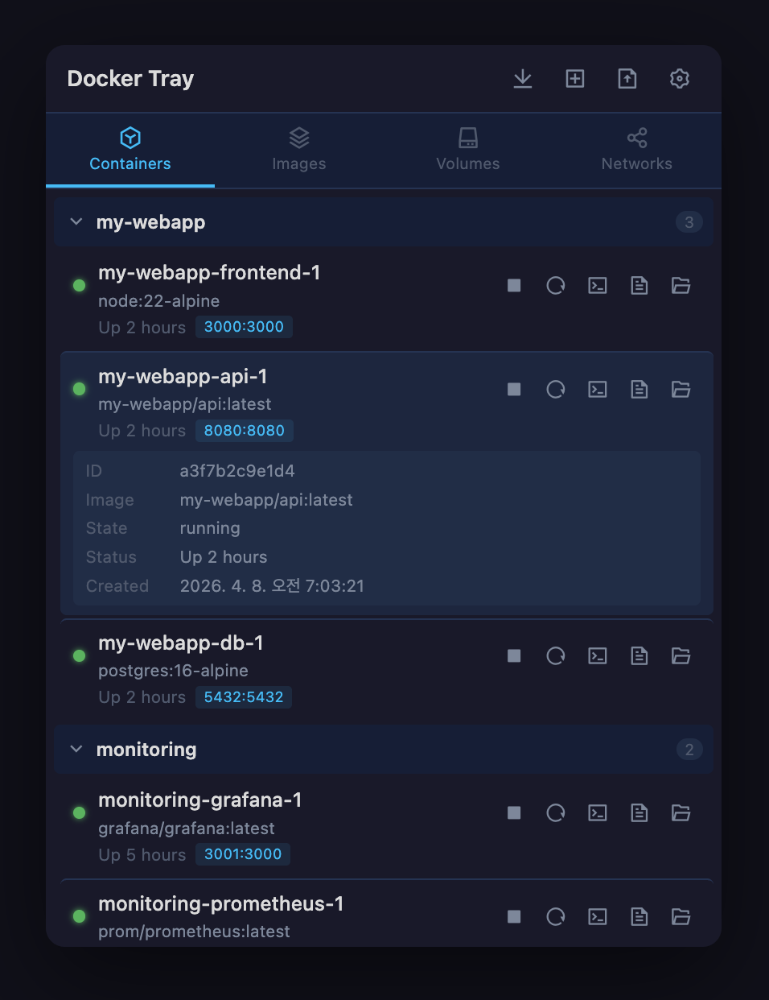

# Docker Tray

<p align="center">
  
</p>

<p align="center">
  macOS 메뉴바에서 Docker 컨테이너, 이미지, 볼륨, 네트워크를 관리하는 경량 앱
  <br/>
  Tauri + React + TypeScript로 개발
  <br/>
  <br/>
  <a href="https://www.apple.com/macos/"></a>
  <a href="https://www.docker.com/"></a>
  <a href="https://nodejs.org/"></a>
  <a href="https://www.rust-lang.org/"></a>
  <a href="LICENSE"></a>
  <br/>
  <br/>
  한국어 / <a href="./README_EN.md">English</a>
</p>

<p align="center">
  
</p>

## 기능

- **시스템 트레이**: 메뉴바에 상주하며 클릭으로 토글
- **컨테이너 관리**: 시작, 중지, 재시작, 삭제
- **Compose 지원**: `docker-compose.yaml` 파일 불러와서 실행
- **이미지 관리**: Pull, 이미지에서 컨테이너 생성, 삭제
- **볼륨 & 네트워크**: 조회 및 삭제
- **로그 뷰어**: 별도 창에서 컨테이너 로그 확인
- **파일 탐색기**: 컨테이너 내부 파일 탐색 및 전송
- **터미널 접속**: 실행 중인 컨테이너에 쉘 접속 (Ghostty, iTerm, Terminal.app 지원)
- **상세 보기**: 아이템 클릭으로 기본 정보 확인, 우클릭으로 삭제
- **창 크기 조절**: 하단 가장자리 드래그로 높이 조절

## 설치

### 스크립트 설치 (권장)

```bash
curl -fsSL https://raw.githubusercontent.com/yurseria/docker-tray/main/scripts/install.sh | bash
```

Gatekeeper quarantine 속성을 자동으로 제거합니다.

### 수동 설치

[Releases](https://github.com/yurseria/docker-tray/releases/latest)에서 `.dmg`를 다운로드한 경우, 서명되지 않은 앱이므로 설치 후 아래 명령어를 실행해야 합니다:

```bash
xattr -rd com.apple.quarantine /Applications/Docker\ Tray.app
```

## 기술 스택

- **프론트엔드**: React 19, TypeScript, Vite
- **백엔드**: Rust, Tauri 2, Bollard (Docker API)
- **Node**: 22 (`.nvmrc` 참고)

## 사전 요구사항

- [Rust](https://rustup.rs/)
- [Node.js 22+](https://nodejs.org/)
- [Docker Desktop](https://www.docker.com/products/docker-desktop/)

## 개발

```bash
npm install
npm run dev:tauri
```

## 빌드

```bash
npm run tauri build
```

빌드된 앱은 `src-tauri/target/release/bundle/`에 생성됩니다.

## 프로젝트 구조

```
├── src/                    # React 프론트엔드
│   ├── components/         # UI 컴포넌트
│   ├── hooks/              # useDocker 훅
│   └── types.ts            # TypeScript 타입
├── src-tauri/              # Rust 백엔드
│   ├── src/
│   │   ├── docker.rs       # Docker API 커맨드
│   │   └── lib.rs          # Tauri 앱 설정, 트레이, 윈도우
│   └── tauri.conf.json     # Tauri 설정
└── vite.config.ts
```

## 라이선스

MIT
